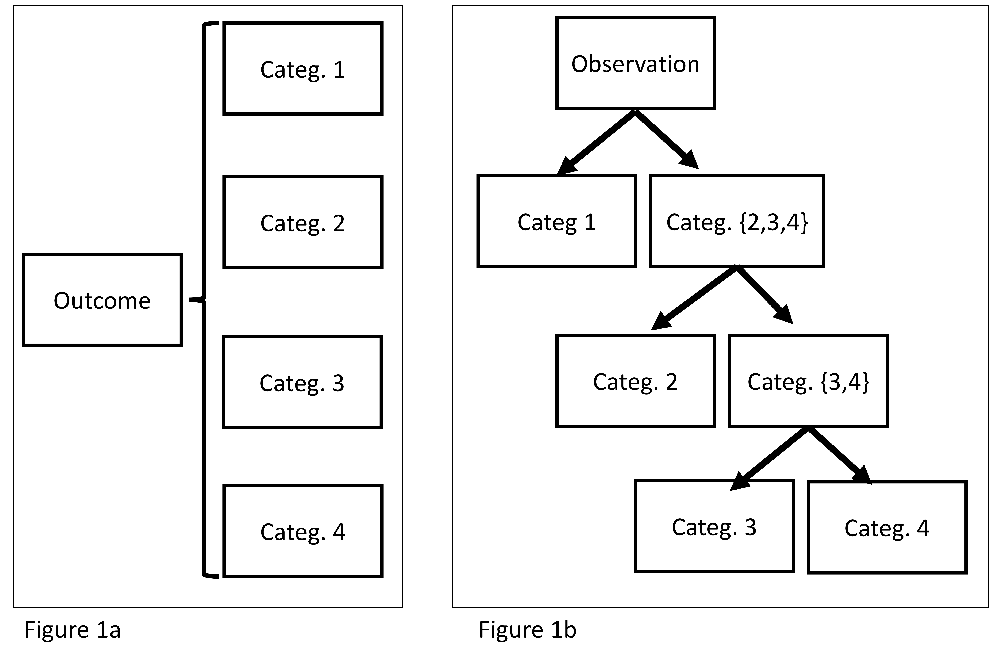
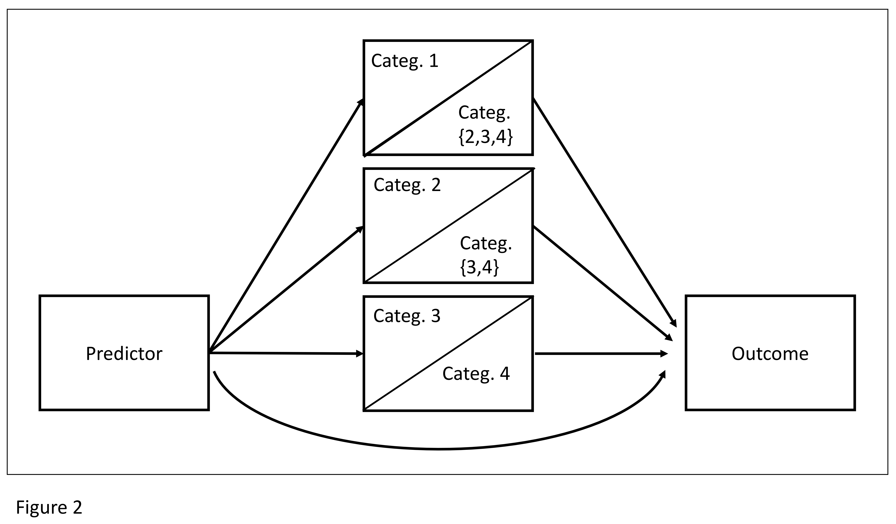

# ConditionalLogisticSEM

The goal of ConditionalLogisticSEM is to .to estimate a conditional logitic regression model 
embedded into a SEM (Structural equation model) structure. The code presented here is by no means designed as an R-package or will ever mature into such a package. However, the code by itsself can be considered mature.

# Data 

## Structure

The ConditionalLogisticSEM is designed to be used with multinomial outcomes that can be rearranged in a binary tree and thus can be cosidered nested (cf Figures 1a & 1b as well as Figure 2). 

## Software for Data collection

The data collection can be conducted via the program CUNIB. The name is based on a German akronym that translates to "Computer assisted classroom observations". Unfortunately CUNIB is -- in its current state --  not very customisable, as it was developed under a very tigh schedule. However the sofware was succesfully used in multiple studies (*paper*) and proofed to be useful.

If you like to use the program for your own research and thus need adaptions, feel free to either fork this repo (please do not forget to mention me as the original software's author; thanks!) or to reach out to me and we will discuss a potential collaboration. 

# 

The program is designed around a state machine, which was implemented as a graph. 

>> Verweis auf Cunib
